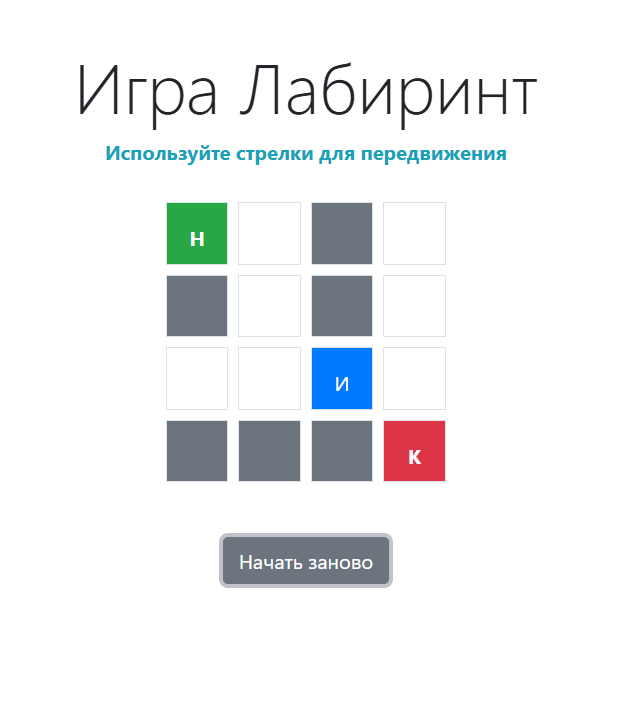

# Labirint Game - React + Vite

This project is a maze game where the player must navigate through a labyrinth to reach the finish line. The game is built with React components and Vite for optimized development and build speed.

[Try the game here!](https://denischugunov.github.io/labirint-game_react-training/)



## Features

- **React Components**: Each part of the game, from player to walls, is structured as an independent React component for modularity.

## Installation and Setup

1. Clone this repository:

   ```bash
   git clone https://github.com/username/labirint-game_react-training.git
   cd labirint-game_react-training
   ```

2. Install dependencies:

   ```bash
   npm install
   ```

3. Start the development server:

   ```bash
   npm run dev
   ```

4. Open `http://localhost:3000` in your browser to play the game locally.

## Available Scripts

- `npm run dev`: Run the app in development mode.
- `npm run build`: Build the app for production.
- `npm run preview`: Preview the production build.
